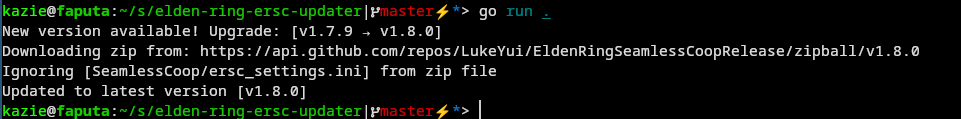

## Elden Ring Seamless Co-op Updater

I have created a simple program to help with updating the [Seamless Co-op](https://www.nexusmods.com/eldenring/mods/510) 
mod for Elden Ring, by using the latest release from the [github mirror](https://github.com/LukeYui/EldenRingSeamlessCoopRelease/releases)

One can typically just update it by hand, but I made this simple program just to help my own lazy ass.



### Config

The config is done in a toml file `config.toml`, that shall be in the same folder as the running program.

```toml
# The last downloaded version v1.7.8 for example
current_version = "v1.7.8"
# The full path to your elden ring game folder
elden_ring_game_path = "/home/username/.local/share/Steam/steamapps/common/ELDEN RING/Game/"
# Github API key with reading public repositories, make one under developer settings -> personal access token
github_read_token = ""
# If it shall ignore writing the ini file (writing ini file may reset password)
ignore_ini_file = true
```

> NOTE: When using Microsoft Windows, file paths need to be escaped like so:  
> `C:\\some\\path\\to\\somewhere` as they use `\ ` natively, but needs to be escaped, thus `\\` 

